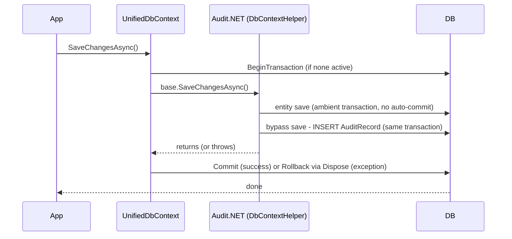

# Unified.Audit

Provides automatic audit trail capture for EF Core `SaveChanges` operations, built directly on top of
[Audit.NET](https://github.com/thepirat000/Audit.NET) (`Audit.EntityFramework.Core`)'s own `AuditDbContext`
and built-in `EntityFrameworkDataProvider` - no custom `IInterceptor` or `AuditDataProvider` subclass.

## How it's wired

`Unified.Db.UnifiedDbContext` inherits Audit.NET's `Audit.EntityFramework.AuditDbContext` instead of plain
`DbContext`. That base class overrides `SaveChanges`/`SaveChangesAsync` itself, so **every** save on
`UnifiedDbContext` is captured automatically - registering an EF Core `IInterceptor` for auditing is not
needed (`api/Unified.Api/Services/InterceptorRegistration.cs` now only registers `SaveRulesInterceptor`,
for business validation, which is unrelated to auditing).

`AddAuditModule()` registers `AuditRecordOptions` (bound from configuration), `AddHttpContextAccessor()`,
and `ICurrentActorResolver` (`HttpContextActorResolver`, which resolves the current user from the
`ClaimsPrincipal`, falling back to the system user when there is no authenticated user).

`UseAuditModule()` must be called once on `app.Services` after `WebApplication.Build()` (Audit.NET's
configuration is a process-wide static, so this can't be done as part of DI registration). It:

- Enables `Audit.Core.Configuration.IncludeActivityTrace` (see Correlation id below).
- Configures Audit.NET's built-in `EntityFrameworkDataProvider` via the `UseEntityFramework` fluent API:
  every audited entity type maps to `AuditRecord` (`AuditTypeMapper(_ => typeof(AuditRecord))`), and
  `AuditRecordEntityAction.Populate` fills in its fields (`IgnoreMatchedProperties(true)`, since property
  names never match between the audited entity and the single shared `AuditRecord` table).
- Configures `Audit.EntityFramework.Configuration.Setup().ForContext<UnifiedDbContext>().UseOptOut().Ignore<AuditRecord>()`
  so writes to the audit table itself are never captured as another audit event.

## Same `DbContext`, no recursion

Since no `UseDbContext(...)` override is configured, Audit.NET's `EntityFrameworkDataProvider` writes the
`AuditRecord` row through the **same** `UnifiedDbContext` instance that was just saved - by calling
`context.Add(auditRecord)` followed by a second, nested `SaveChangesAsync()` on that instance. Because
`UnifiedDbContext` is an `AuditDbContext`, it implements Audit.NET's `IAuditBypass`, so that nested call goes
through `SaveChangesBypassAuditAsync()` - which invokes the *real*, unwrapped `DbContext.SaveChangesAsync()`
directly, skipping the audit wrapper entirely. There is no reentrancy to guard against: the nested save never
triggers `OnScopeCreated`/`OnScopeSaving`/`OnScopeSaved`, and never re-enters `CreateAuditEventAsync`.

EF Core `IInterceptor`s (e.g. `SaveRulesInterceptor`) are a different mechanism and **do** still fire on that
nested call (they're attached at the raw `DbContext` level, not the `AuditDbContext` wrapper level).
`SaveRulesInterceptor` explicitly skips its rule loop when the only pending change is an `AuditRecord`, so
business rules never run against the audit log itself - see `api/Unified.Common/Interceptors/SaveRulesInterceptor.cs`.

## Keeping the entity save and the audit insert atomic

`UnifiedDbContext` overrides `SaveChanges`/`SaveChangesAsync` to wrap the entire call - the entity
save plus the nested `AuditRecord` insert Audit.NET performs on success - in one transaction:

Both the entity save and the bypassed `AuditRecord` insert run on the same `DbContext`/connection, so
they automatically participate in whatever transaction is already ambient
(`Database.CurrentTransaction`) - no Audit.NET hook is needed to coordinate them. If either write
throws, the exception propagates out of `base.SaveChangesAsync()` before `CommitAsync()` is reached;
disposing the `await using`/`using` transaction without committing rolls it back automatically
(standard `DbTransaction` semantics). An already-active ambient transaction (opened by calling code)
is left for its owner to commit/roll back - detected via `Database.CurrentTransaction is not null`.

`AuditRecordEntityAction.Populate` also returns `false` (skip creating an `AuditRecord` entirely) whenever
the entity save didn't succeed, so a failed save never produces an audit row describing a change that never
happened - the transaction rollback above is defense in depth on top of that.

Transaction wrapping only applies to relational providers (`Database.IsRelational()`); the in-memory
provider used by tests doesn't support transactions at all.

## `entry.Action`, not `EntityEntry.State`

`AuditRecordEntityAction.Populate` runs after the entity save has already completed - by that point EF
Core's `ChangeTracker` has already reset each `EntityEntry.State` (`Added`/`Modified` → `Unchanged`,
`Deleted` → `Detached`), so reading `State` here would be stale and wrong. `EventEntry.Action` is Audit.NET's
own string, captured *before* the save (from the pre-save `EntityState`), so it - not the live `EntityEntry`
- is the reliable source for what actually happened. `Action`/`OldValues`/`NewValues` are built from
`entry.Action` ("Insert"/"Update"/"Delete", mapped to "Added"/"Modified"/"Deleted" to match the existing
frontend/validator vocabulary); only `entry.GetEntry().Metadata` (unaffected by the state reset) is read from
the live `EntityEntry`.

## Correlation id

`AuditRecordEntityAction.Populate` sets `record.CorrelationId` from `AuditEvent.Activity.TraceId`, populated
automatically from the ambient `System.Diagnostics.Activity` once `Audit.Core.Configuration.IncludeActivityTrace
= true` is set (done in `AuditModule.UseAuditModule`). ASP.NET Core starts an `Activity` per incoming request,
so this covers HTTP requests and non-HTTP contexts (e.g. Hangfire jobs) alike with no manual `HttpContext`/
`Activity.Current` plumbing required.

## `AuditPropertyExclusion` vs. Audit.NET's own attributes

Column-level exclusion for `AuditRecord.OldValues`/`NewValues` uses `AuditPropertyExclusion.ShouldExclude`,
which is deliberately kept separate from (and layered on top of) Audit.NET's own `[AuditIgnore]` support:

- `[AuditIgnore]`-tagged properties are already stripped out of `EventEntry.ColumnValues`/`Changes` by
  Audit.NET itself before `AuditRecordEntityAction` ever sees them - that's the mechanism to use for
  known, specific fields (e.g. `User.IdirId`/`KeyCloakId`).
- `AuditPropertyExclusion` additionally applies a **deny-list safety net** that Audit.NET's own
  attribute/Fluent config has no equivalent for: any `byte[]` column (regardless of type, no tagging
  needed) and any property name matching a configured pattern (`ExcludedPropertyNames`/
  `ExcludedPropertyNameContains`/`ExcludedPropertyNameEndsWith` in `AuditRecordOptions`, e.g.
  "contains Token/Secret/Password" or "ends with Key") are excluded automatically - so a new sensitive
  field is redacted even if a developer forgets to tag it.
- It's also the only way `AuditSchemaService` (which introspects `UnifiedDbContext.Model` directly, for
  the audit-filter UI) can compute "what fields are audited" without going through an actual Audit.NET
  save event.

## Testing

Because `UnifiedDbContext` inherits `AuditDbContext`, *any* test that constructs one directly and calls
`SaveChangesAsync` would otherwise drive the process-wide `Audit.Core.Configuration` static (writing stray
files via the default `FileDataProvider`, or racing with whatever `DataProvider` another test class
configured). `Unified.Tests`' `ModuleInitialization` sets `Audit.Core.Configuration.AuditDisabled = true`
globally by default for the whole test assembly; `AuditPipelineTests` (the only test class that exercises
this module's audit behavior) explicitly re-enables it around its own test bodies.

