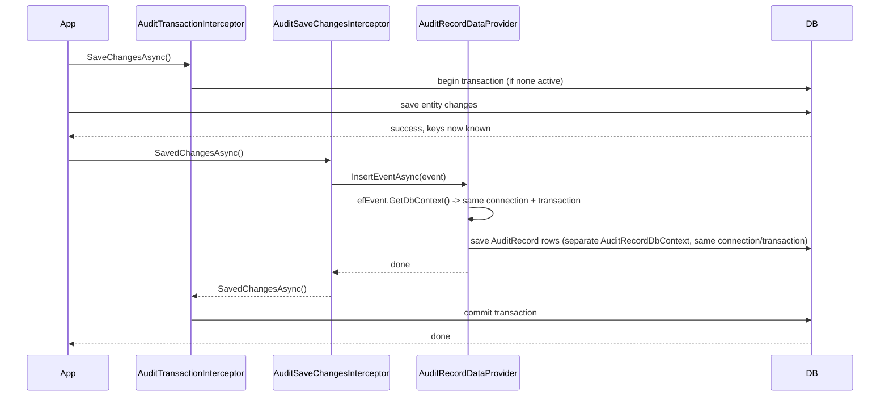

# Unified.Audit

Provides automatic audit trail capture for EF Core `SaveChanges` operations, built on top of the
[Audit.NET](https://github.com/thepirat000/Audit.NET) (`Audit.EntityFramework.Core`) library instead
of a hand-rolled interceptor.

## Registration

`AddAuditModule()` registers `AuditRecordInterceptorOptions` (bound from configuration),
`AddHttpContextAccessor()`, and `ICurrentActorResolver` (`HttpContextActorResolver`, which resolves
the current user from the `ClaimsPrincipal`, falling back to the system user when there is no
authenticated user).

`UseAuditModule()` must be called once on `app.Services` after `WebApplication.Build()`. It wires
Audit.NET's process-wide `Audit.Core.Configuration.DataProvider` to an `AuditRecordDataProvider`
instance (Audit.NET's configuration is a static, so this can't be done as part of DI registration),
enables `Audit.Core.Configuration.IncludeActivityTrace` (see Correlation id below), and configures
`Audit.EntityFramework.Configuration` to never audit the `AuditRecord` table itself.

Two `IInterceptor`s are registered on the audited `DbContext` (see `InterceptorRegistration`), in
this order:

1. **`Audit.EntityFramework.AuditSaveChangesInterceptor`** — Audit.NET's own interceptor. Captures a
   snapshot of every tracked `Added` / `Modified` / `Deleted` entity before the save runs, then — once
   the save completes and generated keys/FKs are resolved — hands the event to the configured data
   provider.
2. **`AuditTransactionInterceptor`** — stamps `BaseEntity.CreatedById` / `UpdatedById` before the save,
   and owns a database transaction spanning the entity save and the audit-record insert (see below).
   Registered *after* Audit.NET's interceptor so its commit only happens once the audit insert has
   succeeded.

## Why a separate `AuditRecordDbContext`

`AuditRecordDataProvider` (the custom `Audit.Core.AuditDataProvider`) writes `AuditRecord` rows via a
dedicated `AuditRecordDbContext` — a minimal context that only maps `AuditRecord` and has no
interceptors attached. This solves two of the three original design goals directly:

- **No re-entrant interceptors**: writing an audit row never re-triggers `SaveRulesInterceptor` or the
  audit pipeline itself. `AuditRecord` is additionally excluded from capture entirely via Audit.NET's
  own Fluent config (`Audit.EntityFramework.Configuration.Setup().ForAnyContext().UseOptOut().Ignore<AuditRecord>()`
  in `AuditModule.UseAuditModule`), so it's never even snapshotted, regardless of which `DbContext` is
  being audited.
- **FK/temporary-key reconciliation "for free"**: Audit.NET populates each `EventEntry`'s primary key /
  column values *after* the underlying save completes, so store-generated keys and foreign keys
  pointing at newly-inserted parents are already resolved by the time `AuditRecordDataProvider` builds
  the `AuditRecord` rows — no deferred-save bookkeeping is required.

## `entry.Action`, not `EntityEntry.State`

`AuditRecordDataProvider` runs inside `AuditSaveChangesInterceptor.SavedChangesAsync`, i.e. *after*
the entity save has already completed. By that point EF Core's `ChangeTracker` has already reset each
`EntityEntry.State` (`Added`/`Modified` → `Unchanged`, `Deleted` → `Detached`), so reading `State` here
is stale and wrong. `EventEntry.Action` is Audit.NET's own string, captured *before* the save (from the
pre-save `EntityState`), so it — not the live `EntityEntry` — is the reliable source for what actually
happened. `Action`/`OldValues`/`NewValues` are built from `entry.Action` ("Insert"/"Update"/"Delete",
mapped to "Added"/"Modified"/"Deleted" to match the existing frontend/validator vocabulary); only
`entry.GetEntry().Metadata` (unaffected by the state reset) is read from the live `EntityEntry`.

## Correlation id

`AuditRecordDataProvider.ResolveCorrelationId` prefers an explicit `X-Correlation-Id`-style request
header, then falls back to `HttpContext.TraceIdentifier` (matching the `traceId` `GlobalExceptionHandler`
returns to API clients, so a client-reported error can be cross-referenced with its audit trail). For
non-HTTP contexts (e.g. Hangfire jobs) where there's no `HttpContext` at all, it falls back to Audit.NET's
own distributed-tracing capture: `AuditEvent.Activity.TraceId`, populated automatically from the ambient
`System.Diagnostics.Activity` once `Audit.Core.Configuration.IncludeActivityTrace = true` is set (done in
`AuditModule.UseAuditModule`) — no manual `Activity.Current` plumbing required.

## `AuditPropertyExclusion` vs. Audit.NET's own attributes

Column-level exclusion for `AuditRecord.OldValues`/`NewValues` uses `AuditPropertyExclusion.ShouldExclude`,
which is deliberately kept separate from (and layered on top of) Audit.NET's own `[AuditIgnore]`
support:

- `[AuditIgnore]`-tagged properties are already stripped out of `EventEntry.ColumnValues`/`Changes` by
  Audit.NET itself before `AuditRecordDataProvider` ever sees them — that's the mechanism to use for
  known, specific fields (e.g. `User.IdirId`/`KeyCloakId`).
- `AuditPropertyExclusion` additionally applies a **deny-list safety net** that Audit.NET's own
  attribute/Fluent config has no equivalent for: any `byte[]` column (regardless of type, no tagging
  needed) and any property name matching a configured pattern (`ExcludedPropertyNames`/
  `ExcludedPropertyNameContains`/`ExcludedPropertyNameEndsWith` in `AuditRecordInterceptorOptions`, e.g.
  "contains Token/Secret/Password" or "ends with Key") are excluded automatically — so a new sensitive
  field is redacted even if a developer forgets to tag it.
- It's also the only way `AuditSchemaService` (which introspects `UnifiedDbContext.Model` directly, for
  the audit-filter UI) can compute "what fields are audited" without going through an actual Audit.NET
  save event.

## Sharing a transaction across two `DbContext` instances

Because the audit row is written through a *different* `DbContext` instance than the one being
audited, atomicity isn't automatic — without care, the entity save could commit before the audit
insert even runs. This is solved by sharing state explicitly, not via `AsyncLocal` or other ambient
state:

`EntityFrameworkEvent.GetDbContext()` returns the *actual* audited `DbContext` instance mid-save, so
`AuditRecordDataProvider` can read its live `Database.GetDbConnection()` /
`Database.CurrentTransaction` and attach the same connection/transaction to the `AuditRecordDbContext`
it constructs (via `Database.UseTransactionAsync`). If either the entity save or the audit insert
fails, `AuditTransactionInterceptor.SaveChangesFailedAsync` rolls back the shared transaction, so
neither is left partially committed.

`AuditTransactionInterceptor` only opens its own transaction if none is already active — if calling
code already started one (e.g. wrapping several operations), the existing transaction is reused and
left for its owner to commit/roll back.

