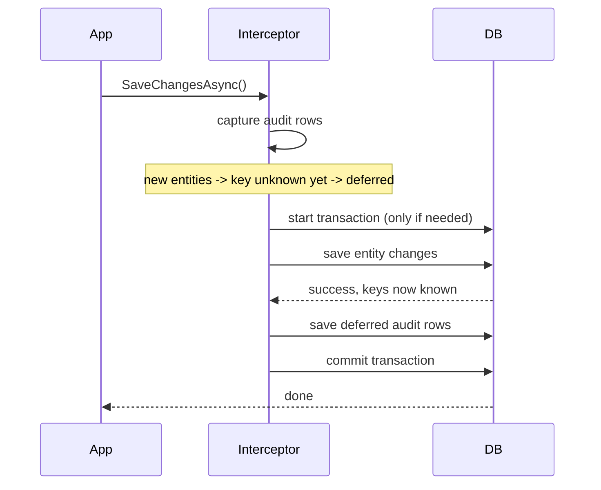

# Unified.Audit

Provides automatic audit trail capture for EF Core `SaveChanges` operations via a `SaveChangesInterceptor`.

## Registration

`AddAuditModule()` registers `AuditRecordInterceptorOptions` (bound from configuration) and `ICurrentActorResolver` (`HttpContextActorResolver`, which resolves the current user from the `ClaimsPrincipal`, falling back to `"system"` when there is no authenticated user).

The `AuditRecordInterceptor` itself is added to the `DbContext` wherever the context is configured, and writes `AuditRecord` rows for every tracked `Added` / `Modified` / `Deleted` entity (excluding `AuditRecord` itself, `byte[]` columns, and any property/name excluded via options or `[AuditExclude]`).

## Transaction lifetime

Why this is tricky: for **new** entities, the real primary key (identity column) isn't known until *after* the save runs. But the audit row needs that key. So new-entity audits can't be written in the same save call — they have to be written in a follow-up save, once the key exists. That follow-up save needs to be protected so it either succeeds together with the original save, or fails together with it.

### Scenario 1 — only updates/deletes (no new entities)

Nothing is deferred. The audit rows are added to the same save call as the entity changes, so they succeed or fail together automatically. No extra transaction is needed.

### Scenario 2 — new entities, no transaction already running (the common case)

1. The interceptor sees it will need a second save later (for the new entities' audit rows), so it opens its own transaction first.
2. It saves the entity changes.
3. It saves the audit rows.
4. It commits the transaction.

If step 2 or step 3 fails, the interceptor rolls back its own transaction, so nothing is left half-saved — either both the entity change and its audit row exist, or neither does.

### Scenario 3 — new entities, but a transaction was already started by someone else

Sometimes calling code wraps several operations in its own transaction before calling `SaveChangesAsync`. In that case the interceptor sees a transaction is already running and does **not** start its own — it just reuses the existing one. This matters because the interceptor no longer controls when that transaction commits or rolls back; whoever started it does.

**1. If the entity save itself fails**

Nothing has been saved yet. The interceptor clears its pending audit data and gets out of the way. It's now up to the code that started the transaction to roll it back (which is the standard pattern — don't commit after an error). Nothing is left inconsistent as long as the caller follows that pattern.

**2. If the audit save fails (after the entity save already succeeded)**

This is the trickier case: the entity change already went through, but the transaction hasn't been committed by its owner yet. The interceptor can't roll anything back itself here (it doesn't own the transaction), so it just rethrows the error.

In practice this is still safe with our database (PostgreSQL): once a command inside a transaction fails, Postgres marks the *whole transaction* as broken — nothing else can be committed on it, only rolled back. So even though the interceptor didn't roll back itself, the entity change can't be committed either. The failure is caught by the database, not by the interceptor.

The one thing to be aware of: this safety net depends on the outer code correctly reacting to the error (not swallowing it and trying to commit anyway). That's a general rule for any code sharing a transaction, not something specific to auditing.

