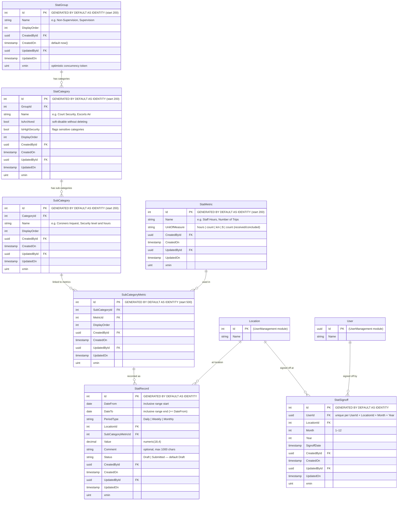

# Stats Module — Data Model

## Entity Relationship Diagram



---

## Field Definitions

### StatGroup

| Column | DB Type | Nullable | Default | Notes |
|---|---|---|---|---|
| `Id` | `integer` | No | identity (start 200) | PK |
| `Name` | `text` | No | — | Display name, e.g. *Non-Supervision* |
| `DisplayOrder` | `integer` | No | — | Sort order in UI |
| `CreatedById` | `uuid` | Yes | — | FK → Users(Id) |
| `CreatedOn` | `timestamptz` | No | `now()` | |
| `UpdatedById` | `uuid` | Yes | — | FK → Users(Id) |
| `UpdatedOn` | `timestamptz` | Yes | — | |
| `xmin` | `xid` | No | system | EF Core concurrency token |

**Seeded data:** 2 rows — `Non-Supervision` (Id 1), `Supervision` (Id 2)

---

### StatCategory

| Column | DB Type | Nullable | Default | Notes |
|---|---|---|---|---|
| `Id` | `integer` | No | identity (start 200) | PK |
| `GroupId` | `integer` | No | — | FK → StatGroups(Id) RESTRICT |
| `Name` | `text` | No | — | e.g. *Court Security*, *Escorts Air - Hours-Trips* |
| `IsArchived` | `boolean` | No | `false` | Soft-disable; archived categories hidden from data entry |
| `IsHighSecurity` | `boolean` | No | `false` | Flags categories requiring elevated access |
| `DisplayOrder` | `integer` | No | — | Sort order within the group |
| `CreatedById` | `uuid` | Yes | — | FK → Users(Id) |
| `CreatedOn` | `timestamptz` | No | `now()` | |
| `UpdatedById` | `uuid` | Yes | — | FK → Users(Id) |
| `UpdatedOn` | `timestamptz` | Yes | — | |
| `xmin` | `xid` | No | system | EF Core concurrency token |

**Seeded data:** 25 rows — Ids 1–14 belong to Non-Supervision, Ids 15–25 to Supervision. Same category name (e.g. *Court Security*) appears in both groups as separate rows.

---

### SubCategory

| Column | DB Type | Nullable | Default | Notes |
|---|---|---|---|---|
| `Id` | `integer` | No | identity (start 200) | PK |
| `CategoryId` | `integer` | No | — | FK → StatCategories(Id) RESTRICT |
| `Name` | `text` | No | — | e.g. *Coroners Inquest*, *General* (placeholder) |
| `DisplayOrder` | `integer` | No | — | Sort order within the category |
| `CreatedById` | `uuid` | Yes | — | FK → Users(Id) |
| `CreatedOn` | `timestamptz` | No | `now()` | |
| `UpdatedById` | `uuid` | Yes | — | FK → Users(Id) |
| `UpdatedOn` | `timestamptz` | Yes | — | |
| `xmin` | `xid` | No | system | EF Core concurrency token |

**Seeded data:** 91 rows (Ids 1–91). Categories without a natural sub-division use a `General` placeholder (Ids 18, 19, 20, 50, 89) so that `StatRecord` always points to a `SubCategoryMetric`, never directly to a category.

---

### StatMetric

| Column | DB Type | Nullable | Default | Notes |
|---|---|---|---|---|
| `Id` | `integer` | No | identity (start 200) | PK |
| `Name` | `text` | No | — | e.g. *Staff Hours*, *Number of Trips* |
| `UnitOfMeasure` | `text` | No | — | `hours` \| `count` \| `km` \| `$` \| `count (received/concluded)` |
| `CreatedById` | `uuid` | Yes | — | FK → Users(Id) |
| `CreatedOn` | `timestamptz` | No | `now()` | |
| `UpdatedById` | `uuid` | Yes | — | FK → Users(Id) |
| `UpdatedOn` | `timestamptz` | Yes | — | |
| `xmin` | `xid` | No | system | EF Core concurrency token |

**Seeded data:** 49 rows — Ids 1–23 (`hours`), 24–42 (`count`), 43–46 (`km`), 47 (`$`), 48–49 (`count (received/concluded)`)

---

### SubCategoryMetric

Junction table between `SubCategory` and `StatMetric`. Each row represents one metric that is applicable to a given sub-category. `StatRecord` always targets a `SubCategoryMetric`, never a raw metric or sub-category directly.

| Column | DB Type | Nullable | Default | Notes |
|---|---|---|---|---|
| `Id` | `integer` | No | identity (start 500) | PK |
| `SubCategoryId` | `integer` | No | — | FK → SubCategories(Id) RESTRICT |
| `MetricId` | `integer` | No | — | FK → StatMetrics(Id) RESTRICT |
| `DisplayOrder` | `integer` | No | — | Sort order of metric within the sub-category |
| `CreatedById` | `uuid` | Yes | — | FK → Users(Id) |
| `CreatedOn` | `timestamptz` | No | `now()` | |
| `UpdatedById` | `uuid` | Yes | — | FK → Users(Id) |
| `UpdatedOn` | `timestamptz` | Yes | — | |
| `xmin` | `xid` | No | system | EF Core concurrency token |

**Seeded data:** 365 rows (Ids 1–365). Identity sequence starts at 500 to avoid collision with seeded rows.

**Metric assignment logic:**

| Sub-category type | Metrics assigned |
|---|---|
| Court Security (NS + SUP, all 34 sub-categories) | Regular Security Staff Hours, Overtime Regular Security Hours, High Security Staff Hours, Overtime High Security Hours |
| Circuit court related travel (NS + SUP) | Staff Hours, Overtime Hours, km Travelled |
| Coroner Jury Administration | Coroner Jury Admin Hours, Coroner Jurors Summonsed, Coroner Panels Created |
| Criminal/Civil Jury Administration | Jury Admin Hours, Jurors Summonsed, Jurors & Alternates Paid, Panels Created, $ Paid |
| Documents Civil/Family & Documents Criminal (NS + SUP) | Staff Hours, Overtime Hours, Received, Concluded |
| Escorts Air (NS + SUP) | Level 1/2/3 Staff + Overtime Hours, Level 1/2/3 Trips, Level 1/2/3 Air counts |
| Escorts Ground (NS + SUP) | Level 1/2/3 Staff + Overtime Hours, Trips, Level 1/2/3 Ground counts + km |
| Escorts females / males | Staff Hours, Overtime Hours, Custodies – Regulars, Custodies – SEG/PC/MH |
| Holding area/cellblock (NS – individual types) | Cell Block Hours, Overtime Staff Hours, Custody counts |
| Holding area/cellblock (NS – Hours, SUP) | Cell Block Hours, Overtime Staff Hours |
| Other (NS + SUP – general duties, SIR, Vehicle) | Staff Hours, Overtime Hours |
| Other – CPIC/JUSTIN | Staff Hours, Overtime Hours, Received, Concluded |
| Other – DNA samples | Staff Hours, Overtime Hours, Number of Samples Taken |
| PIO/SIO (NS + SUP) | Staff Hours, Overtime Hours |
| Training – Instruction (NS + SUP) | Instructor Hours, Instructor Overtime |
| Training – Student (NS + SUP) | PTO Hours, PTO Overtime, Branch Directed Hours, Branch Directed Overtime, Self Development Hours |
| Jury Administration (SUP only) | Jury Administration Hours |

---

### StatRecord

The primary data entry table. Each row is one metric value for one sub-category metric at one location over a date range.

| Column | DB Type | Nullable | Default | Notes |
|---|---|---|---|---|
| `Id` | `integer` | No | identity | PK |
| `DateFrom` | `date` | No | — | Inclusive period start |
| `DateTo` | `date` | No | — | Inclusive period end; must be ≥ DateFrom |
| `PeriodType` | `text` | No | — | `Daily` \| `Weekly` \| `Monthly` |
| `LocationId` | `integer` | No | — | FK → Locations(Id) RESTRICT |
| `SubCategoryMetricId` | `integer` | No | — | FK → SubCategoryMetrics(Id) RESTRICT |
| `Value` | `numeric(18,4)` | No | — | The measured value |
| `Comment` | `text` | Yes | — | Optional free-text note, max 1 000 chars |
| `Status` | `text` | No | `Draft` | `Draft` \| `Submitted` |
| `CreatedById` | `uuid` | Yes | — | FK → Users(Id) |
| `CreatedOn` | `timestamptz` | No | `now()` | |
| `UpdatedById` | `uuid` | Yes | — | FK → Users(Id) |
| `UpdatedOn` | `timestamptz` | Yes | — | |
| `xmin` | `xid` | No | system | EF Core concurrency token |

**Indexes:** `LocationId`, `SubCategoryMetricId`, `(DateFrom, DateTo)`

**Status lifecycle:**
```
[form filled] → Draft (Save Draft) → Submitted (Submit)
                  ↑_________________|  (re-open / edit allowed while Draft)
```

**Period type date rules (frontend-enforced):**

| PeriodType | DateFrom | DateTo |
|---|---|---|
| `Daily` | Today | Today |
| `Weekly` | Monday of current week | Sunday of current week |
| `Monthly` | 1st of current month | Last day of current month |

---

### StatSignoff

Records that a supervisor has reviewed and signed off all stat records for a given location, month, and year. The combination of `(UserId, LocationId, Month, Year)` is unique.

| Column | DB Type | Nullable | Default | Notes |
|---|---|---|---|---|
| `Id` | `integer` | No | identity | PK |
| `UserId` | `uuid` | No | — | FK → Users(Id) RESTRICT |
| `LocationId` | `integer` | No | — | FK → Locations(Id) RESTRICT |
| `Month` | `integer` | No | — | 1–12 |
| `Year` | `integer` | No | — | Four-digit year |
| `SignoffDate` | `timestamptz` | No | — | When the signoff occurred |
| `CreatedById` | `uuid` | Yes | — | FK → Users(Id) |
| `CreatedOn` | `timestamptz` | No | `now()` | |
| `UpdatedById` | `uuid` | Yes | — | FK → Users(Id) |
| `UpdatedOn` | `timestamptz` | Yes | — | |
| `xmin` | `xid` | No | system | EF Core concurrency token |

**Unique index:** `(UserId, LocationId, Month, Year)`

---

## Cross-Module References

The Stats module references two entities from the `UserManagement` module by foreign key only — it does not own or duplicate those tables.

| Referenced table | Used in | Purpose |
|---|---|---|
| `Locations` | `StatRecord.LocationId`, `StatSignoff.LocationId` | The physical location where hours were worked |
| `Users` | `StatSignoff.UserId`, all `CreatedById` / `UpdatedById` audit fields | Identity of the signing officer and audit trail |

---

## Identity Sequence Summary

| Table | Seeded ID range | Identity start |
|---|---|---|
| `StatGroups` | 1–2 | 200 |
| `StatCategories` | 1–25 | 200 |
| `SubCategories` | 1–91 | 200 |
| `StatMetrics` | 1–49 | 200 |
| `SubCategoryMetrics` | 1–365 | 500 |
| `StatRecords` | *(none — data entry)* | 1 (default) |
| `StatSignoffs` | *(none — data entry)* | 1 (default) |
