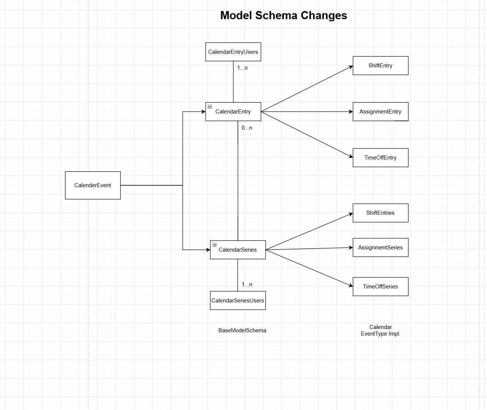
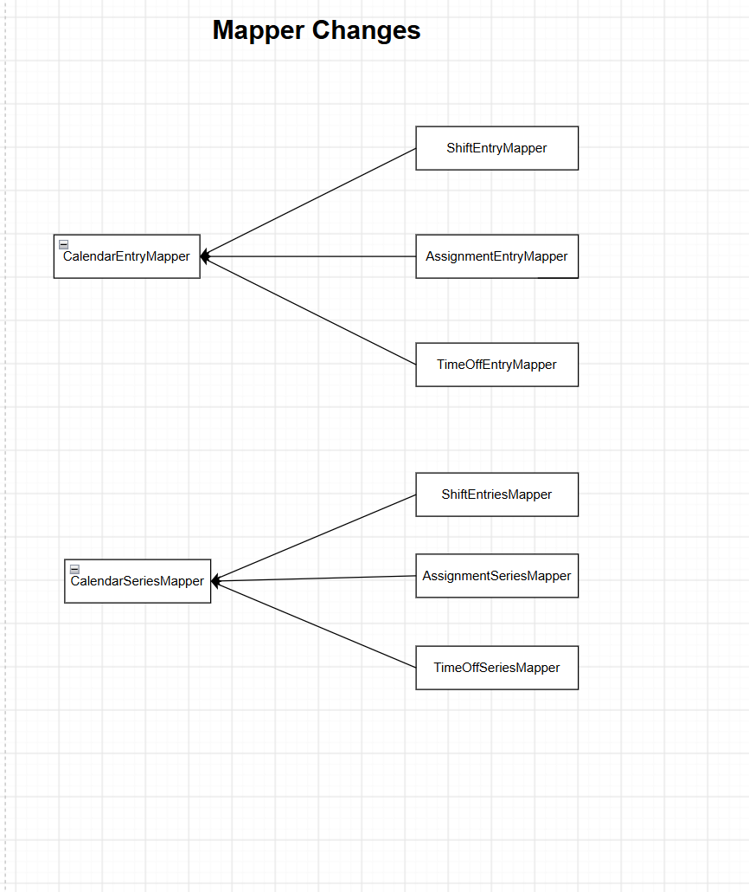
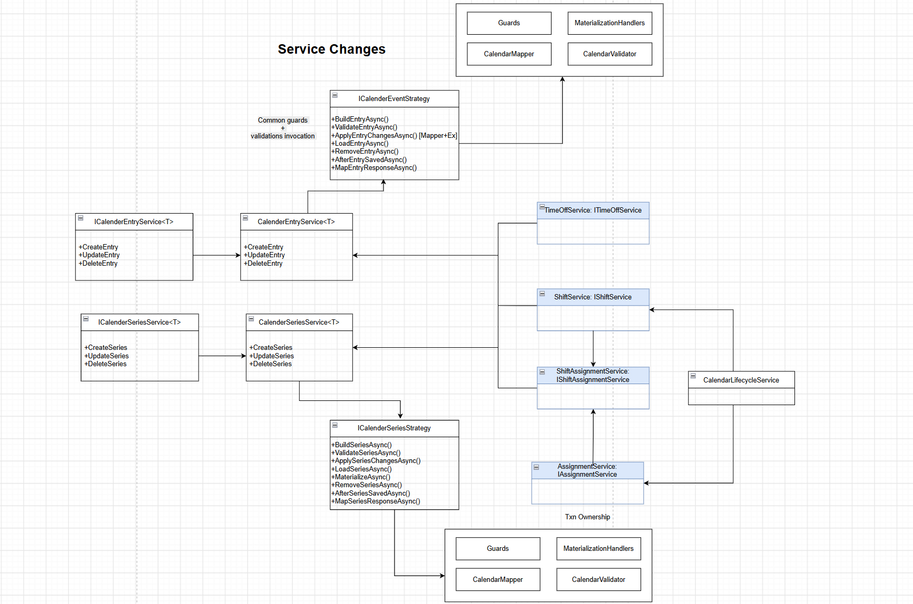

# Calendar Scheduling Improvements

## Purpose

Consolidate shared calendar behavior while keeping shift, assignment, and time-off details in their respective domain components. The diagrams below describe proposed improvements.

## 1. Model Schema Improvements

- Introduce shared `CalendarEntry` and `CalendarSeries` models for common calendar fields.
- Keep event-specific details in the shift, assignment, and time-off models shown in the diagram.
- Represent entry and series user associations through `CalendarEntryUsers` and `CalendarSeriesUsers`.

## 2. Mapper Improvements

- Centralize common entry mapping in `CalendarEntryMapper`.
- Centralize common series mapping in `CalendarSeriesMapper`.
- Have shift, assignment, and time-off mappers reuse common mapping and add their domain-specific fields.

## 3. Service Improvements

- Reuse `CalendarEntryService<T>` and `CalendarSeriesService<T>` for common entry and series preparation workflows.
- Use shared, non-generic strategy contracts for common operations where the inputs expose a shared contract.
- Keep guards, validation, mapping, and materialization responsibilities explicit.
- Inject both entry and series services into domain services through composition.
- Domain services add event-specific details and own persistence. Shared calendar services do not call `SaveChangesAsync()`.

### Responsibility Boundaries

| Component | Responsibility |
| --- | --- |
| Shared entry/series services | Prepare common calendar changes and invoke common guards and validation |
| Shared strategies | Implement common build, load, apply, remove, and materialization behavior |
| Domain services | Add domain details, validate domain rules, and save changes |
| Mappers | Map common and domain-specific fields |
| Materialization handlers | Prepare recurring occurrences and their related details |
| Lifecycle service | Coordinate operations across domain services when required |

### Create Workflow

1. The domain service calls the shared entry or series service.
2. The shared service validates common inputs and builds the calendar model.
3. Control returns to the domain service, which adds domain-specific details and validates them.
4. The domain service persists the complete changes.
5. Any explicitly required post-save hooks run after saving; external side effects run after a successful transaction commit.

## Embedded Images

The diagrams are generated using drawio. [Download editable diagram](./Unified.Scheduling.drawio)
